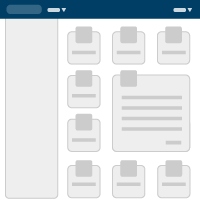

## Layouts
Consistent and anticipated layouts allow users to navigate and understand applications with more ease. These layout and content types cover most use-cases for standard web applications.

#### Layout Types

##### Fluid 1

[View example](layouts/fluid_wApp.html){:target="_blank"}

This page illustrates:
* Universal Header
* Application Header
* Fluid body content
* No Sidebar

The Fluid 1 page layout provides maximum space for content. It leaves control over the size of the interface to the user by automatically adjusting to fit the size of their browser window. Note that some types of content (like large bodies of text) can become hard to read due to excessively long line lengths, if nothing is done to mitigate this. Consistent margin padding creates a natural frame for the content and scroll navigation.

{: .clearfix}


To do


##### Fluid 2

[View example](layouts/fluid.html){:target="_blank"}

This page illustrates:
* Universal Header
* Fluid body content
* No Sidebar

The Fluid 2 page layout is similar to Fluid 1, but has no Application Header used.

{: .clearfix}


To do


##### Hybrid 1

[View example](layouts/hybrid_wApp.html){:target="_blank"}

This page illustrates:
* Universal Header
* Application Header
* Responsive body content
* No Sidebar

The Hybrid 1 page layout combines the fluid design of the CBP Universal and Application headers with a fixed width design for the rest of the content area below. The Hybrid page layout should be used in cases where a fixed width page layout is desirable but where the Application header might contain a large number of items. This layout preserves the CBP brand placement, respecting the left page margin padding, to be consistent with other page layouts.

{: .clearfix}


To do


##### Hybrid 2

[View example](layouts/hybrid.html){:target="_blank"}

This page illustrates:
* Universal Header
* Responsive body content
* No Sidebar

The Hybrid 2 page layout illustrates the fluid design of the blue CBP Universal Header (mandatory) with a fixed width design for the rest of the content area below. This layout preserves the CBP brand placement, respecting the left page margin padding, to be consistent with other page layouts. This example layout has no Application Header, which is optional.

{: .clearfix}


To do


##### Navigation 1

[View example](layouts/type-content-navigation_wFixedSide.html){:target="_blank"}

This page illustrates:
* Universal Header
* Application Header
* Fluid body content
* Sidebar with scroll bar

The Navigation 1 page layout has a column for vertical navigation to the left of the content area (in this case “Filters”), which is useful for when a long list of navigation links is necessary. The sidebar list scrolls independently of the main page content for instances where filter selections should not distract focus from top tier page content.

{: .clearfix}


To do


##### Navigation 2

[View example](layouts/type-content-navigation_wApp.html){:target="_blank"}

This page illustrates:
* Universal Header
* Application Header
* Fluid body content
* Sidebar without scroll 

The Navigation 2 page layout is exactly the same as Navigation 1, except that the sidebar does not scroll independently from main page content. In Navigation 2, the whole page scrolls. The Application level header will become sticky (stay at the top of the page) to accommodate continued navigation throughout the user experience.

{: .clearfix}


To do


##### Branded Card Dashboard

[View example](layouts/brand-card-layout.html){:target="_blank"}

This page illustrates:
* Universal Header
* Application Header
* Fluid body content
* Sidebar without scroll 
* Branded Card UI

The Branded Card Dashboard page layout is designed to aid users in easily navigating multiple unique options. Clicking on the card expands its footprint within the page grid to display more information and points of action.

{: .clearfix}


To do
 

*** See Vertical navigation and Horizontal navigation for more detail.
{: .clearfix}

