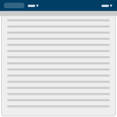
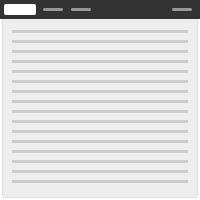
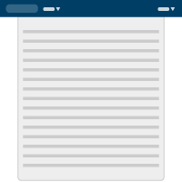
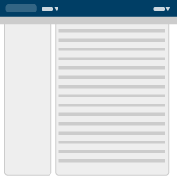
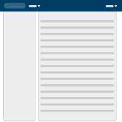

## Layouts
Consistent and anticipated layouts allow users to navigate and understand applications with more ease. These layout and content types cover most use-cases for standard web applications.

#### Layout types

##### Fluid

[View example](layouts/fluid_wApp.html){:target="_blank"}

The fluid page layout provides maximum space for content in all sizes. It leaves control over the size of the interface to the user by automatically adjusting to fit the size of their browser. Note that some types of content (like large bodies of text) can become hard to read due to excessively long line lengths, if nothing is done to mitigate this.

Equal padding should be observed left and right of the page content. At no point should text fall behind a browser scroll bar.

{: .clearfix}


<form role="form" class="form">
  

    <label for="ta12" class="mdl-textfield__label">Normal</label>
    <textarea class="mdl-textfield__input" id="ta12" rows="2"></textarea>
  

  

    <label for="ta13" class="mdl-textfield__label">Disabled</label>
    <textarea class="mdl-textfield__input" id="ta13" rows="2" disabled></textarea>
  
  
</form>


##### Fluid

[View example](layouts/fluid.html){:target="_blank"}

The fluid page layout provides maximum space for content in all sizes. It leaves control over the size of the interface to the user by automatically adjusting to fit the size of their browser. Note that some types of content (like large bodies of text) can become hard to read due to excessively long line lengths, if nothing is done to mitigate this.

Equal padding should be observed left and right of the page content. At no point should text fall behind a browser scroll bar.

{: .clearfix}


<form role="form" class="form">
  

    <label for="ta12" class="mdl-textfield__label">Normal</label>
    <textarea class="mdl-textfield__input" id="ta12" rows="2"></textarea>
  

  

    <label for="ta13" class="mdl-textfield__label">Disabled</label>
    <textarea class="mdl-textfield__input" id="ta13" rows="2" disabled></textarea>
  
  
</form>


##### Hybrid

[View example](layouts/hybrid_wApp.html){:target="_blank"}

The hybrid page layout combines the fluid design for the application header with a fixed width design for the rest of the content area. It should only be used in cases where a fixed width page layout is desirable but where the Application header might contain a large number of items.

{: .clearfix}


<form role="form" class="form">
  

    <label for="ta12" class="mdl-textfield__label">Normal</label>
    <textarea class="mdl-textfield__input" id="ta12" rows="2"></textarea>
  

  

    <label for="ta13" class="mdl-textfield__label">Disabled</label>
    <textarea class="mdl-textfield__input" id="ta13" rows="2" disabled></textarea>
  
  
</form>


##### Hybrid

[View example](layouts/hybrid.html){:target="_blank"}

The hybrid page layout combines the fluid design for the application header with a fixed width design for the rest of the content area. It should only be used in cases where a fixed width page layout is desirable but where the Application header might contain a large number of items.

{: .clearfix}


<form role="form" class="form">
  

    <label for="ta12" class="mdl-textfield__label">Normal</label>
    <textarea class="mdl-textfield__input" id="ta12" rows="2"></textarea>
  

  

    <label for="ta13" class="mdl-textfield__label">Disabled</label>
    <textarea class="mdl-textfield__input" id="ta13" rows="2" disabled></textarea>
  
  
</form>


##### Navigation and content

[View example](layouts/type-content-navigation_wApp.html){:target="_blank"}

The navigation and content layout has a column for vertical navigation to the left of the content area, which is useful for when a long list of navigation links is necessary.

{: .clearfix}


<form role="form" class="form">
  

    <label for="ta12" class="mdl-textfield__label">Normal</label>
    <textarea class="mdl-textfield__input" id="ta12" rows="2"></textarea>
  

  

    <label for="ta13" class="mdl-textfield__label">Disabled</label>
    <textarea class="mdl-textfield__input" id="ta13" rows="2" disabled></textarea>
  
  
</form>


##### Navigation and content

[View example](layouts/type-content-navigation.html){:target="_blank"}

The navigation and content layout has a column for vertical navigation to the left of the content area, which is useful for when a long list of navigation links is necessary.

{: .clearfix}


<form role="form" class="form">
  

    <label for="ta12" class="mdl-textfield__label">Normal</label>
    <textarea class="mdl-textfield__input" id="ta12" rows="2"></textarea>
  

  

    <label for="ta13" class="mdl-textfield__label">Disabled</label>
    <textarea class="mdl-textfield__input" id="ta13" rows="2" disabled></textarea>
  
  
</form>


*** See Vertical navigation and Horizontal navigation for more detail.
{: .clearfix}

