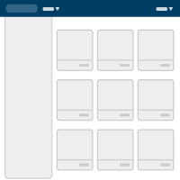

## Layouts
Consistent and anticipated layouts allow users to navigate and understand applications with more ease. These layout and content types cover most use-cases for standard web applications.

#### Layout Types

##### Fluid 1

[View example](layouts/fluid_wApp.html){:target="_blank"}

This page illustrates:
* Universal Header
* Application Header
* Fluid body content
* No Sidebar

The Fluid 1 page layout provides maximum space for content. It leaves control over the size of the interface to the user by automatically adjusting to fit the size of their browser window. Note that some types of content (like large bodies of text) can become hard to read due to excessively long line lengths, if nothing is done to mitigate this. Consistent margin padding creates a natural frame for the content and scroll navigation.

{: .clearfix}


<!--Skip Navigation -->
<a href="#main-content" class="sr-only sr-only-focusable">Skip to main content</a>

	

		

			

				<a class="navbar-brand" href="../">
					U.S. Customs &amp; Border Protection
					U.S. CBP
					U.S. Department of Homeland Security
				</a>
				<button data-target="#navbar-user-info" data-toggle="collapse" type="button" class="navbar-toggle">
				Toggle Global Navigation
				</button>
			

			

				<ul class="nav navbar-nav navbar-left">
					<li class="dropdown">
						<a class="dropdown-toggle" data-toggle="dropdown" role="button" href="#" aria-expanded="false">Application Name   <!-- Your application name goes here!!!-->
					</a>
					<!--Initalize menu here -->
				</li>
			</ul>
			<ul class="nav navbar-nav navbar-right">
				<li>
					<a href="#">
						
						Feedback
					</a>
				</li>
				<li data-toggle="hover" class="dropdown">
					<a href="#" data-toggle="dropdown" class="dropdown-toggle">
						
						First Last Name
						
					</a>
					<ul rel="right-menu-links" role="menu" class="dropdown-menu">
						<li>
							<a title="Preferences" href="#">Preferences</a>
						</li>
						<li class="divider"></li>
						<li>
							<a title="Logout" href="#">Logout</a>
						</li>
					</ul>
				</li>
			</ul>
		

	

	

		

			

				

					<h1 class="page-header">Page Heading</h1>
					
Add Page content here

				

			

		

	



##### Fluid 2

[View example](layouts/fluid.html){:target="_blank"}

This page illustrates:
* Universal Header
* Fluid body content
* No Sidebar

The Fluid 2 page layout is similar to Fluid 1, but has no Application Header used.

{: .clearfix}


<!--Skip Navigation -->
<a href="#main-content" class="sr-only sr-only-focusable">Skip to main content</a>

	

		

			

				<a class="navbar-brand" href="../">
					U.S. Customs &amp; Border Protection
					U.S. CBP
					U.S. Department of Homeland Security
				</a>
				<button data-target="#navbar-user-info" data-toggle="collapse" type="button" class="navbar-toggle">
				Toggle Global Navigation
				</button>
			

			

				<ul class="nav navbar-nav navbar-left">
					<li class="dropdown">
						<a class="dropdown-toggle" data-toggle="dropdown" role="button" href="#" aria-expanded="false">Application Name   <!-- Your application name goes here!!!-->
					</a>
					<!--Initalize menu here -->
				</li>
			</ul>
			<ul class="nav navbar-nav navbar-right">
				<li>
					<a href="#">
						
						Feedback
					</a>
				</li>
				<li data-toggle="hover" class="dropdown">
					<a href="#" data-toggle="dropdown" class="dropdown-toggle">
						
						First Last Name
						
					</a>
					<ul rel="right-menu-links" role="menu" class="dropdown-menu">
						<li>
							<a title="Preferences" href="#">Preferences</a>
						</li>
						<li class="divider"></li>
						<li>
							<a title="Logout" href="#">Logout</a>
						</li>
					</ul>
				</li>
			</ul>
		

	

	

		

			

				<button type="button" class="navbar-toggle collapsed" data-toggle="collapse" data-target="#bs-example-navbar-collapse-1">
				Toggle Application Navigation
				
				
				
				</button>
			

			<!-- Collect the nav links, forms, and other content for toggling -->
			

				

					<ul class="nav nav-tabs nav-tabs-light" role="tablist">
						<li class="active" role="presentation">
							<a href="http://www.google.com" target="_blank" role="tab">Active App View Link</a>
						</li>
						<li role="presentation">
							<a href="#" role="tab" data-toggle="tab">Normal App View Link</a>
						</li>
						<li class="disabled" role="presentation">
							<a role="tab">Disabled App View Link</a>
						</li>
					</ul>
				

				

					<form role="search">
						

							

								

									<label for="main-search" class="mdl-textfield__label">Search</label>
									<input type="text" id="main-search" class="mdl-textfield__input" />
								

								
									<button aria-label="Search" type="submit" class="btn btn-primary"><i class="fa fa-search"></i></button>
								
							

						

					</form>
				

			

		

	

	

		

			

				

					<h1 class="page-header">Page Heading</h1>
					
Add Page content here

				

			

		

	



##### Hybrid 1

[View example](layouts/hybrid_wApp.html){:target="_blank"}

This page illustrates:
* Universal Header
* Application Header
* Responsive body content
* No Sidebar

The Hybrid 1 page layout combines the fluid design of the CBP Universal and Application headers with a fixed width design for the rest of the content area below. The Hybrid page layout should be used in cases where a fixed width page layout is desirable but where the Application header might contain a large number of items. This layout preserves the CBP brand placement, respecting the left page margin padding, to be consistent with other page layouts.

{: .clearfix}


<!--Skip Navigation -->
<a href="#main-content" class="sr-only sr-only-focusable">Skip to main content</a>

		

			

				

					<a class="navbar-brand" href="../">
						U.S. Customs &amp; Border Protection
						U.S. CBP
						U.S. Department of Homeland Security
					</a>
					<button data-target="#navbar-user-info" data-toggle="collapse" type="button" class="navbar-toggle">
					Toggle Global Navigation
					</button>
				

				

					<ul class="nav navbar-nav navbar-left">
						<li class="dropdown">
							<a class="dropdown-toggle" data-toggle="dropdown" role="button" href="#" aria-expanded="false">Application Name   <!-- Your application name goes here!!!-->
						</a>
						<!--Initalize menu here -->
					</li>
				</ul>
				<ul class="nav navbar-nav navbar-right">
					<li>
						<a href="#">
							
							Feedback
						</a>
					</li>
					<li data-toggle="hover" class="dropdown">
						<a href="#" data-toggle="dropdown" class="dropdown-toggle">
							
							First Last Name
							
						</a>
						<ul rel="right-menu-links" role="menu" class="dropdown-menu">
							<li>
								<a title="Preferences" href="#">Preferences</a>
							</li>
							<li class="divider"></li>
							<li>
								<a title="Logout" href="#">Logout</a>
							</li>
						</ul>
					</li>
				</ul>
			

		

		

			

				

					<h1 class="page-header">Page Heading</h1>
					
Add Page content here

				

			

		



##### Hybrid 2

[View example](layouts/hybrid.html){:target="_blank"}

This page illustrates:
* Universal Header
* Responsive body content
* No Sidebar

The Hybrid 2 page layout illustrates the fluid design of the blue CBP Universal Header (mandatory) with a fixed width design for the rest of the content area below. This layout preserves the CBP brand placement, respecting the left page margin padding, to be consistent with other page layouts. This example layout has no Application Header, which is optional.

{: .clearfix}


<a href="#main-content" class="sr-only sr-only-focusable">Skip to main content</a>

	

		

			

				<a class="navbar-brand" href="../">
					U.S. Customs &amp; Border Protection
					U.S. CBP
					U.S. Department of Homeland Security
				</a>
				<button data-target="#navbar-user-info" data-toggle="collapse" type="button" class="navbar-toggle">
				Toggle Global Navigation
				</button>
			

			

				<ul class="nav navbar-nav navbar-left">
					<li class="dropdown">
						<a class="dropdown-toggle" data-toggle="dropdown" role="button" href="#" aria-expanded="false">Application Name   <!-- Your application name goes here!!!-->
					</a>
					<!--Initalize menu here -->
				</li>
			</ul>
			<ul class="nav navbar-nav navbar-right">
				<li>
					<a href="#">
						
						Feedback
					</a>
				</li>
				<li data-toggle="hover" class="dropdown">
					<a href="#" data-toggle="dropdown" class="dropdown-toggle">
						
						First Last Name
						
					</a>
					<ul rel="right-menu-links" role="menu" class="dropdown-menu">
						<li>
							<a title="Preferences" href="#">Preferences</a>
						</li>
						<li class="divider"></li>
						<li>
							<a title="Logout" href="#">Logout</a>
						</li>
					</ul>
				</li>
			</ul>
		

	

	

		

			

				<button type="button" class="navbar-toggle collapsed" data-toggle="collapse" data-target="#bs-example-navbar-collapse-1">
				Toggle Application Navigation
				
				
				
				</button>
			

			<!-- Collect the nav links, forms, and other content for toggling -->
			

				

					<ul class="nav nav-tabs nav-tabs-light" role="tablist">
						<li class="active" role="presentation">
							<a href="http://www.google.com" target="_blank" role="tab">Active App View Link</a>
						</li>
						<li role="presentation">
							<a href="#" role="tab" data-toggle="tab">Normal App View Link</a>
						</li>
						<li class="disabled" role="presentation">
							<a role="tab">Disabled App View Link</a>
						</li>
					</ul>
				

				

					<form role="search">
						

							

								

									<label for="main-search" class="mdl-textfield__label">Search</label>
									<input type="text" id="main-search" class="mdl-textfield__input" />
								

								
									<button aria-label="Search" type="submit" class="btn btn-primary"><i class="fa fa-search"></i></button>
								
							

						

					</form>
				

			

		

	

	

		

			

				<h1 class="page-header">Page Heading</h1>
				
Add Page content here

			

		

	



##### Navigation 1

[View example](layouts/type-content-navigation_wFixedSide.html){:target="_blank"}

This page illustrates:
* Universal Header
* Application Header
* Fluid body content
* Sidebar with scroll bar

The Navigation 1 page layout has a column for vertical navigation to the left of the content area (in this case “Filters”), which is useful for when a long list of navigation links is necessary. The sidebar list scrolls independently of the main page content for instances where filter selections should not distract focus from top tier page content.

{: .clearfix}


<a href="#main-content" class="sr-only sr-only-focusable">Skip to main content</a>

	

		

			

				<a class="navbar-brand" href="../">
					U.S. Customs &amp; Border Protection
					U.S. CBP
					U.S. Department of Homeland Security
				</a>
				<button data-target="#navbar-user-info" data-toggle="collapse" type="button" class="navbar-toggle">
				Toggle Global Navigation
				</button>
			

			

				<ul class="nav navbar-nav navbar-left">
					<li class="dropdown">
						<a class="dropdown-toggle" data-toggle="dropdown" role="button" href="#" aria-expanded="false">Application Name   <!-- Your application name goes here!!!-->
					</a>
					<!--Initalize menu here -->
				</li>
			</ul>
			<ul class="nav navbar-nav navbar-right">
				<li>
					<a href="#">
						
						Feedback
					</a>
				</li>
				<li data-toggle="hover" class="dropdown">
					<a href="#" data-toggle="dropdown" class="dropdown-toggle">
						
						First Last Name
						
					</a>
					<ul rel="right-menu-links" role="menu" class="dropdown-menu">
						<li>
							<a title="Preferences" href="#">Preferences</a>
						</li>
						<li class="divider"></li>
						<li>
							<a title="Logout" href="#">Logout</a>
						</li>
					</ul>
				</li>
			</ul>
		

	

	

		

			

				<button type="button" class="navbar-toggle collapsed" data-toggle="collapse" data-target="#bs-example-navbar-collapse-1">
				Toggle Application Navigation
				
				
				
				</button>
			

			<!-- Collect the nav links, forms, and other content for toggling -->
			

				

					<ul class="nav nav-tabs nav-tabs-light" role="tablist">
						<li class="active" role="presentation">
							<a href="http://www.google.com" target="_blank" role="tab">Active App View Link</a>
						</li>
						<li role="presentation">
							<a href="#" role="tab" data-toggle="tab">Normal App View Link</a>
						</li>
						<li class="disabled" role="presentation">
							<a role="tab">Disabled App View Link</a>
						</li>
					</ul>
				

				

					<form role="search">
						

							

								

									<label for="main-search" class="mdl-textfield__label">Search</label>
									<input type="text" id="main-search" class="mdl-textfield__input" />
								

								
									<button aria-label="Search" type="submit" class="btn btn-primary"><i class="fa fa-search"></i></button>
								
							

						

					</form>
				

			

		

	

	

		

			

				
 Add side bar content here

			

			

				<h1 class="page-header">Page heading</h1>
				
Add Page content here

			

		

	



##### Navigation 2

[View example](layouts/type-content-navigation_wApp.html){:target="_blank"}

This page illustrates:
* Universal Header
* Application Header
* Fluid body content
* Sidebar without scroll 

The Navigation 2 page layout is exactly the same as Navigation 1, except that the sidebar does not scroll independently from main page content. In Navigation 2, the whole page scrolls. The Application level header will become sticky (stay at the top of the page) to accommodate continued navigation throughout the user experience.

{: .clearfix}


<a href="#main-content" class="sr-only sr-only-focusable">Skip to main content</a>

	

		

			

				<a class="navbar-brand" href="../">
					U.S. Customs &amp; Border Protection
					U.S. CBP
					U.S. Department of Homeland Security
				</a>
				<button data-target="#navbar-user-info" data-toggle="collapse" type="button" class="navbar-toggle">
				Toggle Global Navigation
				</button>
			

			

				<ul class="nav navbar-nav navbar-left">
					<li class="dropdown">
						<a class="dropdown-toggle" data-toggle="dropdown" role="button" href="#" aria-expanded="false">Application Name   <!-- Your application name goes here!!!-->
					</a>
					<!--Initalize menu here -->
				</li>
			</ul>
			<ul class="nav navbar-nav navbar-right">
				<li>
					<a href="#">
						
						Feedback
					</a>
				</li>
				<li data-toggle="hover" class="dropdown">
					<a href="#" data-toggle="dropdown" class="dropdown-toggle">
						
						First Last Name
						
					</a>
					<ul rel="right-menu-links" role="menu" class="dropdown-menu">
						<li>
							<a title="Preferences" href="#">Preferences</a>
						</li>
						<li class="divider"></li>
						<li>
							<a title="Logout" href="#">Logout</a>
						</li>
					</ul>
				</li>
			</ul>
		

	

	

		

			

				<button type="button" class="navbar-toggle collapsed" data-toggle="collapse" data-target="#bs-example-navbar-collapse-1">
				Toggle Application Navigation
				
				
				
				</button>
			

			<!-- Collect the nav links, forms, and other content for toggling -->
			

				

					<ul class="nav nav-tabs nav-tabs-light" role="tablist">
						<li class="active" role="presentation">
							<a href="http://www.google.com" target="_blank" role="tab">Active App View Link</a>
						</li>
						<li role="presentation">
							<a href="#" role="tab" data-toggle="tab">Normal App View Link</a>
						</li>
						<li class="disabled" role="presentation">
							<a role="tab">Disabled App View Link</a>
						</li>
					</ul>
				

				

					<form role="search">
						

							

								

									<label for="main-search" class="mdl-textfield__label">Search</label>
									<input type="text" id="main-search" class="mdl-textfield__input" />
								

								
									<button aria-label="Search" type="submit" class="btn btn-primary"><i class="fa fa-search"></i></button>
								
							

						

					</form>
				

			

		

	

	

		

			

				
 Add side bar content here

			

			

				<h1 class="page-header">Page heading</h1>
				
Add Page content here

			

		

	



##### Branded Card Dashboard

[View example](layouts/brand-card-layout.html){:target="_blank"}

This page illustrates:
* Universal Header
* Application Header
* Fluid body content
* Sidebar without scroll 
* Branded Card UI

The Branded Card Dashboard page layout is designed to aid users in easily navigating multiple unique options. Clicking on the card expands its footprint within the page grid to display more information and points of action.

{: .clearfix}


<a href="#main-content" class="sr-only sr-only-focusable">Skip to main content</a>

	

		

			

				<a class="navbar-brand" href="../">
					U.S. Customs &amp; Border Protection
					U.S. CBP
					U.S. Department of Homeland Security
				</a>
				<button data-target="#navbar-user-info" data-toggle="collapse" type="button" class="navbar-toggle">
				Toggle Global Navigation
				</button>
			

			

				<ul class="nav navbar-nav navbar-left">
					<li class="dropdown">
						<a class="dropdown-toggle" data-toggle="dropdown" role="button" href="#" aria-expanded="false">Application Name   <!-- Your application name goes here!!!-->
					</a>
					<!--Initalize menu here -->
				</li>
			</ul>
			<ul class="nav navbar-nav navbar-right">
				<li>
					<a href="#">
						
						Feedback
					</a>
				</li>
				<li data-toggle="hover" class="dropdown">
					<a href="#" data-toggle="dropdown" class="dropdown-toggle">
						
						First Last Name
						
					</a>
					<ul rel="right-menu-links" role="menu" class="dropdown-menu">
						<li>
							<a title="Preferences" href="#">Preferences</a>
						</li>
						<li class="divider"></li>
						<li>
							<a title="Logout" href="#">Logout</a>
						</li>
					</ul>
				</li>
			</ul>
		

	

	

		

			

				<button type="button" class="navbar-toggle collapsed" data-toggle="collapse" data-target="#bs-example-navbar-collapse-1">
				Toggle Application Navigation
				
				
				
				</button>
			

			<!-- Collect the nav links, forms, and other content for toggling -->
			

				

					<h1 class="heading-text">App Heading</h1>
				

				

					<form role="search">
						

							

								

									<label for="main-search" class="mdl-textfield__label">Search</label>
									<input type="text" id="main-search" class="mdl-textfield__input" />
								

								
									<button aria-label="Search" type="submit" class="btn btn-primary"><i class="fa fa-search"></i></button>
								
							

						

					</form>
				

			

		

	

	

		

			

				<h2 role="button">Section Heading</h2>
				
 Add side bar content here

			

			

				<h2>Page Heading</h2>
				

					<!-- repeat the card pattern-->
					

						

						

							<h3 class="mdl-card__title-text text-center">Card with svg image</h3>
						

						

							
Lorem Ipsum is simply dummy text of the printing and typesetting industry. Lorem Ipsum has been the industry's standard dummy text ever since the 1500s, when an unknown printer took a galley of type and scrambled it to make a type specimen book.

							<ul class="list-inline text-italic">
								<li>Sample</li>
								<li>Sample</li>
								<li>Sample</li>
								<li>Sample</li>
							</ul>
							
<a href="#">Watch Tool Tour Video</a>

							
<a href="#">Access info</a> | <i class="fa fa-warning text-warning"></i> Sample warning text

						

						

							<button class="btn btn-circle">
							<i class="fa fa-ellipsis-h" aria-hidden="true"></i>
							</button>
							<button class="btn btn-default pull-right">
							<i class="fa fa-share-square-o"></i> Launch Tool
							</button>
						

					

				

			

		

	



##### Card Dashboard

[View example](layouts/card-layout.html){:target="_blank"}

This page illustrates:
* Universal Header
* Application Header
* Fluid body content
* Sidebar with scroll 
* Card UI

The Card Dashboard page layout is designed to cleanly display access to multiple unbranded endpoints. Clicking on the card expands its footprint within the page grid to display more information and points of action. Individual cards rise on rollover and potentially expand upon selection to show more information and/or administrative options.

{: .clearfix}


<a href="#main-content" class="sr-only sr-only-focusable">Skip to main content</a>

	

		

			

				<a class="navbar-brand" href="../">
					U.S. Customs &amp; Border Protection
					U.S. CBP
					U.S. Department of Homeland Security
				</a>
				<button data-target="#navbar-user-info" data-toggle="collapse" type="button" class="navbar-toggle">
				Toggle Global Navigation
				</button>
			

			

				<ul class="nav navbar-nav navbar-left">
					<li class="dropdown">
						<a class="dropdown-toggle" data-toggle="dropdown" role="button" href="#" aria-expanded="false">Application Name   <!-- Your application name goes here!!!-->
					</a>
					<!--Initalize menu here -->
				</li>
			</ul>
			<ul class="nav navbar-nav navbar-right">
				<li>
					<a href="#">
						
						Feedback
					</a>
				</li>
				<li data-toggle="hover" class="dropdown">
					<a href="#" data-toggle="dropdown" class="dropdown-toggle">
						
						First Last Name
						
					</a>
					<ul rel="right-menu-links" role="menu" class="dropdown-menu">
						<li>
							<a title="Preferences" href="#">Preferences</a>
						</li>
						<li class="divider"></li>
						<li>
							<a title="Logout" href="#">Logout</a>
						</li>
					</ul>
				</li>
			</ul>
		

	

	

		

			

				<button type="button" class="navbar-toggle collapsed" data-toggle="collapse" data-target="#bs-example-navbar-collapse-1">
				Toggle Application Navigation
				
				
				
				</button>
			

			<!-- Collect the nav links, forms, and other content for toggling -->
			

				

					<h1 class="heading-text">App Heading</h1>
				

				

					<form role="search">
						

							

								

									<label for="main-search" class="mdl-textfield__label">Search</label>
									<input type="text" id="main-search" class="mdl-textfield__input" />
								

								
									<button aria-label="Search" type="submit" class="btn btn-primary"><i class="fa fa-search"></i></button>
								
							

						

					</form>
				

			

		

	

	

		

			

				<h2 role="button">Section Heading</h2>
				
 Add side bar content here

			

			

				<h2>Page Heading</h2>
				

					<!-- repeat the card pattern-->
					

						

							

								<h3 class="mdl-card__title-text">Heading for the card</h3>
							

							

								
Lorem ipsum dolor sit amet, consectetur adipiscing elit, sed do eiusmod tempor incididunt ut labore et dolore magna aliqua. Ut enim ad minim veniam, quis nostrud exercitation ullamco laboris nisi ut aliquip ex ea commodo consequat. Duis aute irure dolor in reprehenderit in voluptate velit esse cillum dolore eu fugiat nulla pariatur. Excepteur sint occaecat cupidatat non proident, sunt in culpa qui officia deserunt mollit anim id est laborum.

							

							

								<button type="button" class="btn btn-icon-only btn-xs btn-hover">
								<i class="fa fa-star"></i>
								Favorite
								</button>
								<button type="button" class="btn btn-icon-only btn-xs btn-hover">
								<i class="fa fa-pencil-square-o"></i>
								Edit
								</button>
								<button class="btn btn-primary btn-xs pull-right">
								Go to App
								</button>
							

						

					

				

			

		

	

 

{: .clearfix}

